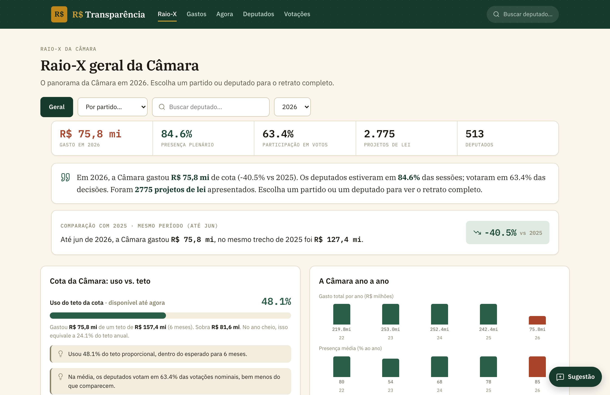

# Resumo Real

Transparência da Câmara dos Deputados (e TSE) **legível para qualquer pessoa**: quem está
gastando, com o quê e com quem; quem votou o quê; presença, salário e dados de eleições,
com resumos em linguagem simples gerados por IA.

**🌐 No ar: [real-transparencia-production.up.railway.app](https://real-transparencia-production.up.railway.app)**. Todo deploy em produção fica disponível nesse endereço.

[](https://real-transparencia-production.up.railway.app/relatorio)

Dados oficiais: API e arquivos abertos da [Câmara](https://dadosabertos.camara.leg.br) e do
[TSE](https://dadosabertos.tse.jus.br). Sem raspagem de HTML.

## Rodar localmente (preview rápido)

```bash
uv sync                                   # instala dependências
uv run python -m app.ingest sample        # popula via API (segundos)
uv run uvicorn app.main:app --reload      # abre http://127.0.0.1:8000
```

Por padrão usa **SQLite** local (`resumo_real.db`), nada a instalar. Para os resumos de IA,
defina `GEMINI_API_KEY` ou `XAI_API_KEY` (veja `.env.example`).

## Histórico completo (2008+)

```bash
uv run python -m app.ingest backfill --de 2008 --ate 2026
```

Baixa os arquivos em massa (CEAP, votações, votos, orientações, presença, proposições) e os
dados do TSE nos anos de eleição. Pesado, rode com Postgres (defina `DATABASE_URL`).

## Como os dados são atualizados

Dois comandos, papéis diferentes:

- **`backfill`** reconstrói o histórico a partir dos arquivos em massa. Roda uma vez (ou quando
  quiser reprocessar). Enriquece o roster com CPF/e-mail/telefone do gabinete (para casar com o
  TSE).
- **`daily`** é a atualização incremental para o cron. **Não-destrutivo e atômico:** faz upsert
  do roster preservando CPF/telefone, atualiza só as votações recentes por id (sem tocar no
  histórico) e regrava as despesas/proposições do ano corrente cada uma numa única transação,
  então um arquivo ainda não publicado (404) ou um download truncado nunca deixa o banco
  pela metade. Sai com código de erro se algum passo falhar, para o cron sinalizar.

```bash
uv run python -m app.ingest daily         # idempotente: rodar de novo não duplica nem apaga
```

## Testes

```bash
uv sync --extra dev
uv run pytest
```

Cobrem os parsers de CSV (vírgula decimal, encoding, datas), a idempotência/atomicidade da
ingestão (rodar `daily` não pode duplicar nem apagar histórico) e um smoke das queries em
SQLite (pega regressões e quebras de portabilidade SQLite/Postgres). Rodam no CI a cada push
(`.github/workflows/ci.yml`).

## Deploy no Railway

1. Crie um projeto, adicione o plugin **Postgres** (gera `DATABASE_URL`).
2. Conecte o repositório, o Railway detecta via Nixpacks e usa o `Procfile`/`railway.json`.
3. Defina variáveis: `DATABASE_URL` (auto), `GEMINI_API_KEY` ou `XAI_API_KEY`.
4. Backfill: `railway run uv run python -m app.ingest backfill`.
5. Agende um **Cron** diário: `uv run python -m app.ingest daily`.

## Pra onde vamos

O plano inclui **cobrança pelas redes sociais** (post pré-pronto mencionando o deputado,
compartilhar no WhatsApp, card com os números do mandato) e **expandir para o poder
municipal**: prefeitos e vereadores das 5.570 cidades, começando pelos dados eleitorais do
TSE e pelas finanças das prefeituras. Detalhes e progresso no [ROADMAP](ROADMAP.md).

## Contribuindo

Quer ajudar? O trabalho está organizado nas **[Issues](../../issues)**: escolha uma (as
`good first issue` são as portas de entrada), **comente que vai pegar** pra todo mundo saber
quem está em quê, e abra o PR. O CI roda os testes automaticamente. O passo a passo completo
e os padrões do projeto estão no **[CONTRIBUTING.md](CONTRIBUTING.md)**.

O **deploy em produção** é manual, feito pelo mantenedor após o merge: roda os testes e sobe
os dois serviços (web + cron de ingestão) no Railway.

## Estrutura

- `app/ingest/`: coleta (API + arquivos em massa) e CLI `sample | backfill | daily`.
- `app/queries.py`: consultas de leitura (rankings, placares, presença, eleições).
- `app/analysis/`: cliente de IA (Gemini/Grok) + resumos cacheados.
- `app/main.py` + `app/templates/`: site FastAPI + Jinja2.
- `tests/`: pytest (parsers, ingestão, queries).

## Aviso

Os números vêm de fontes oficiais. Os **resumos em linguagem simples são gerados por IA** a
partir desses dados e podem conter imprecisões; são identificados como tais na interface e não
substituem a fonte primária, sempre linkada.

## Licença

[MIT](LICENSE).
